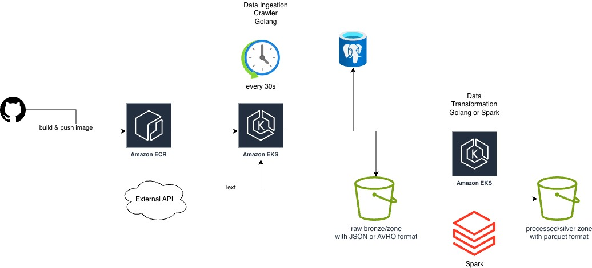

# data-engineer-golang
golang data engineer e2e delivery

## Architecture



The external API is https://openweathermap.org/api/current?collection=current_forecast.

### Components

#### Computation Layers
1. Data Ingestion (API scrapper)
   1. Based on requirement of exposes endpoints for Prometheus, it needs to run on AWS EKS or AWS Fargate.
2. Data Transformation
   1. Based on project requirements, it uses Golang do the data cleaning and transformation.
   2. Alternatively, we could consider Spark solution like databricks or AWS glue.
   3. Transformation logic
      1. I decided **not to drop any fields** in order to **maintain a faithful representation in the processed/silver zone**, which will then serve as the foundation for business-ready gold layer.
      2. A filed in the API response is called dt. I will rename it to `event_time` as we will have `dt` as data lake's partition bucket.
      3. Selected top-level objects in the API response will be flattened. For example, the coord object below will be split into two separate columns: `coord_lat` and `coord_lon`. I am flattening these fields because they are likely to be used as query conditions by end users.
```json
{
  "coord": {
    "lon": 10.99,
    "lat": 44.34
  }
}
```

#### Storage Layers 
1. Use the JSONB data type to store raw API responses in PostgreSQL.
2. The file name is {dt_from_JSON_top-level_field}_{lat}_{lon}.<file_extension>.
3. Raw/bronze zone
   1. The data format is JSON, but AVRO could be a better alternative. 
   2. I chose JSON because it is the native format of the API response and remains easily human-readable.
   3. Avro is a better alternative because of its fast row-based read performance, low storage overhead, and robust support for schema evolution.
4. Processed/Silver zone
   1. The data format is parquet.
   2. I chose Parquet because it is optimized for columnar read performance and minimal storage overhead.

## Questions
1. What's the usage of PostgreSQL except it will be the first place we store the external API data?
2. Do we need to consider retry and idempotent writing?
